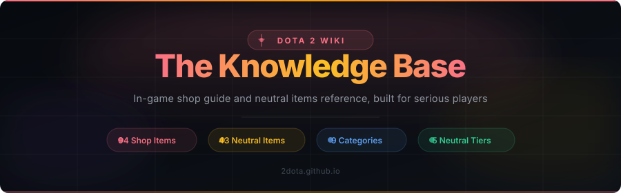
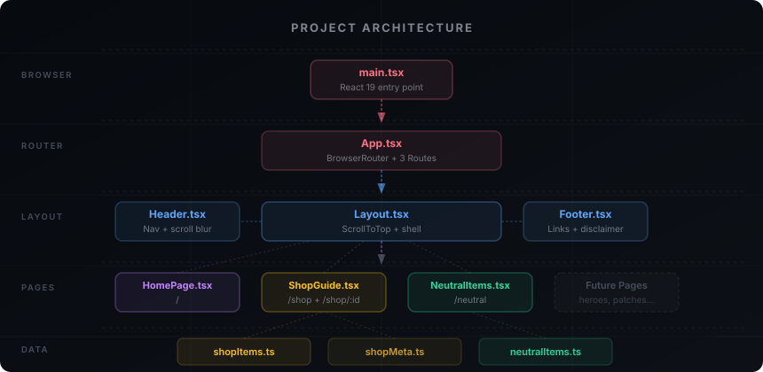

<div align="center">



<br/>
<br/>

[](https://2dota.github.io)
[](https://github.com/2dota/2dota.github.io/actions)
[](https://react.dev)
[](https://www.typescriptlang.org)
[](https://tailwindcss.com)
[](https://vite.dev)

</div>

---

## What is this?

**2dota.github.io** is a dark-themed, production-ready reference site for Dota 2 players who want to deeply understand the item economy. It covers every purchasable shop item and every neutral item that drops from the jungle, with real stats, build paths, hidden mechanics, and pro-level tips for each one.

All artwork is served directly from Valve's official CDN, the same source used by the Dota 2 store and website itself.

---

## Pages

<table>
<tr>
<td width="50%">

### Home

The landing page. Two section cards guide visitors to the two main content areas. A hero section with animated stats, CTAs to both guides, and a "Coming Soon" grid for future pages.

</td>
<td width="50%">

```
/
```

**Components:** animated hero, stat pills, section cards, coming-soon grid

</td>
</tr>
<tr>
<td>

### In-Game Shop Guide

Complete reference for all 94 purchasable items in the Dota 2 shop (the F4 menu). Items organized into 9 categories with searchable filtering, item costs, stats, active and passive abilities, build paths, and a hidden mechanics panel for each item.

</td>
<td>

```
/shop
/shop/:id
```

**Components:** category tabs, search bar, item grid, item detail page, build path sidebar, hidden mechanics panel

</td>
</tr>
<tr>
<td>

### Neutral Items Guide

All 43 neutral items across 5 tiers that drop in the Dota 2 jungle. Organized by tier with drop time windows, full stats, tips, and a click-to-open detail modal. Includes an updated system guide for the Madstone crafting system introduced in patch 7.38.

</td>
<td>

```
/neutral
```

**Components:** tier tabs, item grid with tier badges, detail modal, how-it-works guide, general strategy section

</td>
</tr>
</table>

---

## Architecture

<div align="center">

</div>

<br/>

```
src/
├── App.tsx                        # Router setup (BrowserRouter + 3 routes)
│
├── components/
│   └── layout/
│       ├── Layout.tsx             # Page shell: Header + main + Footer
│       ├── Header.tsx             # Fixed nav with scroll-aware blur
│       ├── Footer.tsx             # Links + legal disclaimer
│       └── ScrollToTop.tsx        # Resets scroll on every route change
│
├── data/
│   ├── shopItems.ts               # 94 shop items with stats, tips, build paths
│   ├── shopMeta.ts                # Category colors + Lucide icons (shared)
│   └── neutralItems.ts            # 43 neutral items across 5 tiers + system notes
│
└── pages/
    ├── HomePage.tsx               # Landing page
    ├── ShopGuidePage.tsx          # /shop - grid with category tabs
    ├── ShopItemDetailPage.tsx     # /shop/:id - full item detail
    └── NeutralItemsPage.tsx       # /neutral - tier grid + modal
```

---

## Item Coverage

### Shop - 9 Categories, 94 Items

```
Consumables   ████████████░░░░░░░░  12 items   Tangos, Salves, Smokes, Wards
Attributes    ████████░░░░░░░░░░░░   8 items   Branches, Circlets, Bracers
Equipment     ████████████████░░░░  16 items   Boots, Blink, Force Staff
Support       ████████████░░░░░░░░  12 items   Mekansm, Pipe, Glimmer Cape
Magical       ████████░░░░░░░░░░░░   8 items   Scythe, Dagon, Orchid
Armor         ██████████████░░░░░░  10 items   Heart, Assault, Shiva's Guard
Weapons       ████████████████████  16 items   Daedalus, Battle Fury, MKB
Artifacts     ████████████░░░░░░░░  12 items   BKB, Aghs Scepter, Rapier, Skadi
```

### Neutral Items - 5 Tiers, 43 Items

```
Tier 1   0:00 - 7:00    ██████████   8 items   Chipped Vest, Kobold Cup
Tier 2   7:00 - 17:00   ████████░░   7 items   Essence Ring, Mana Draught
Tier 3   17:00 - 27:00  ██████████  10 items   Titan Sliver, Gale Guard
Tier 4   27:00 - 37:00  ██████████  10 items   Spell Prism, Havoc Hammer
Tier 5   37:00+         ████████░░   8 items   Apex, Force Boots, Mirror Shield
```

---

## Tech Stack

<table>
<tr>
<th>Layer</th>
<th>Technology</th>
<th>Version</th>
<th>Purpose</th>
</tr>
<tr>
<td>UI Framework</td>
<td></td>
<td>19.2</td>
<td>Component model, hooks, strict mode</td>
</tr>
<tr>
<td>Language</td>
<td></td>
<td>6.0</td>
<td>Full type safety on all data models and components</td>
</tr>
<tr>
<td>Styling</td>
<td></td>
<td>v4</td>
<td>Utility-first CSS via Vite plugin, zero config</td>
</tr>
<tr>
<td>Build Tool</td>
<td></td>
<td>8.2</td>
<td>Sub-second HMR, optimized production bundles</td>
</tr>
<tr>
<td>Routing</td>
<td></td>
<td>7.18</td>
<td>Client-side routing with BrowserRouter</td>
</tr>
<tr>
<td>Animation</td>
<td></td>
<td>13.1</td>
<td>Page transitions, modal animations, stagger effects</td>
</tr>
<tr>
<td>Icons</td>
<td></td>
<td>1.34</td>
<td>All UI icons, zero emoji or font-icon usage</td>
</tr>
<tr>
<td>Linter</td>
<td></td>
<td>1.79</td>
<td>Rust-based linter, faster than ESLint</td>
</tr>
<tr>
<td>Hosting</td>
<td></td>
<td></td>
<td>Static hosting via GitHub Actions CI/CD</td>
</tr>
<tr>
<td>Images</td>
<td></td>
<td></td>
<td>Official item artwork from cdn.cloudflare.steamstatic.com</td>
</tr>
</table>

---

## Image Source

All item images are loaded from Valve's official Cloudflare CDN:

```
https://cdn.cloudflare.steamstatic.com/apps/dota2/images/dota_react/items/{slug}.png
```

This is the same CDN used by `dota2.com` and the Dota 2 store. Images update automatically with each game patch and require no local storage or build-time downloading.

> **Note on neutral item slugs:** Valve uses internal codenames that differ from display names. For example, Tumbler's Toy is `pogo_stick`, Brigand's Blade is `misericorde`, and Gunpowder Gauntlet is `gunpowder_gauntlets`. Always verify slugs against the [Dota 2 Wiki](https://dota2.fandom.com/wiki/Neutral_Items) when adding new items.

---

## Adding Items

All item data lives in two TypeScript files. To add or update an item, edit the relevant file and follow the existing interface shape. The TypeScript compiler catches any missing required fields or type mismatches before the build completes.

**Shop item** in `src/data/shopItems.ts`:

```typescript
{
  id: 'my_item',
  name: 'My Item',
  slug: 'my_item',          // must match Valve CDN internal filename
  category: 'Weapons',
  cost: 3000,
  imageUrl: img('my_item'),
  description: 'What this item does.',
  stats: ['+30 Damage'],
  active: 'Ability Name: Description.',
  tips: ['Tip one.', 'Tip two.'],
  buildsFrom: ['Component Name'],
  buildsInto: ['Upgrade Name'],
  tier: 'Upgrade',
}
```

**Neutral item** in `src/data/neutralItems.ts`:

```typescript
{
  id: 'my_neutral',
  name: 'My Neutral',
  slug: 'internal_name',    // use Valve internal name, not display name
  tier: 3,
  imageUrl: img('internal_name'),
  description: 'What this item does.',
  stats: ['+15 All Stats'],
  passive: 'Passive Name: Description.',
  tips: ['Tip one.', 'Tip two.'],
  dropTime: '17:00 - 27:00',
}
```

---

## Roadmap

| Page | Status |
|------|--------|
| Home | Live |
| In-Game Shop Guide | Live |
| Neutral Items Guide | Live |
| Heroes Reference | Planned |
| Patch Notes History | Planned |
| Meta Tier Lists | Planned |
| Strategy Guides | Planned |

---

## License

Fan-made project. Not affiliated with or endorsed by Valve Corporation.

Dota 2 is a trademark of Valve Corporation. All item names, artwork, and descriptions are the property of Valve Corporation. Item images are served from Valve's official public CDN.

---

<div align="center">

Built with React 19, TypeScript, Tailwind CSS v4, and Vite 8.

[](https://2dota.github.io)

</div>
